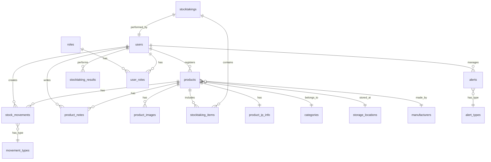

# IPグッズ在庫管理システム DB設計書

## 1. 概要

### 1.1 データベース選定
- RDBMS: PostgreSQL 14以上
- 文字コード: UTF-8
- タイムゾーン: Asia/Tokyo

### 1.2 命名規則
- テーブル名: 複数形、スネークケース（例: products, stock_movements）
- カラム名: スネークケース（例: created_at, product_name）
- 主キー: id（UUID型）
- 外部キー: テーブル名の単数形_id（例: product_id）

## 2. ER図

## 3. テーブル定義

### 3.1 users（ユーザー）
| カラム名 | データ型 | NULL | デフォルト | 説明 |
|---------|----------|------|-----------|------|
| id | UUID | NO | gen_random_uuid() | 主キー |
| email | VARCHAR(255) | NO | - | メールアドレス（ユニーク） |
| password_hash | VARCHAR(255) | NO | - | パスワードハッシュ |
| name | VARCHAR(100) | NO | - | ユーザー名 |
| is_active | BOOLEAN | NO | true | アクティブフラグ |
| last_login_at | TIMESTAMP | YES | - | 最終ログイン日時 |
| created_at | TIMESTAMP | NO | CURRENT_TIMESTAMP | 作成日時 |
| updated_at | TIMESTAMP | NO | CURRENT_TIMESTAMP | 更新日時 |

### 3.2 roles（ロール）
| カラム名 | データ型 | NULL | デフォルト | 説明 |
|---------|----------|------|-----------|------|
| id | UUID | NO | gen_random_uuid() | 主キー |
| name | VARCHAR(50) | NO | - | ロール名 |
| description | TEXT | YES | - | 説明 |
| permissions | JSONB | NO | {} | 権限設定 |
| created_at | TIMESTAMP | NO | CURRENT_TIMESTAMP | 作成日時 |

### 3.3 user_roles（ユーザーロール）
| カラム名 | データ型 | NULL | デフォルト | 説明 |
|---------|----------|------|-----------|------|
| user_id | UUID | NO | - | ユーザーID（FK） |
| role_id | UUID | NO | - | ロールID（FK） |
| assigned_at | TIMESTAMP | NO | CURRENT_TIMESTAMP | 割当日時 |

### 3.4 categories（カテゴリー）
| カラム名 | データ型 | NULL | デフォルト | 説明 |
|---------|----------|------|-----------|------|
| id | UUID | NO | gen_random_uuid() | 主キー |
| name | VARCHAR(100) | NO | - | カテゴリー名 |
| parent_id | UUID | YES | - | 親カテゴリーID |
| sort_order | INTEGER | NO | 0 | 表示順 |
| created_at | TIMESTAMP | NO | CURRENT_TIMESTAMP | 作成日時 |

### 3.5 storage_locations（保管場所）
| カラム名 | データ型 | NULL | デフォルト | 説明 |
|---------|----------|------|-----------|------|
| id | UUID | NO | gen_random_uuid() | 主キー |
| name | VARCHAR(100) | NO | - | 場所名 |
| code | VARCHAR(50) | NO | - | 場所コード |
| description | TEXT | YES | - | 説明 |
| created_at | TIMESTAMP | NO | CURRENT_TIMESTAMP | 作成日時 |

### 3.6 licensors（版元）
| カラム名 | データ型 | NULL | デフォルト | 説明 |
|---------|----------|------|-----------|------|
| id | UUID | NO | gen_random_uuid() | 主キー |
| name | VARCHAR(200) | NO | - | 版元名 |
| contact_info | VARCHAR(500) | YES | - | 連絡先情報 |
| created_at | TIMESTAMP | NO | CURRENT_TIMESTAMP | 作成日時 |

### 3.7 licensees（ライセンシー）
| カラム名 | データ型 | NULL | デフォルト | 説明 |
|---------|----------|------|-----------|------|
| id | UUID | NO | gen_random_uuid() | 主キー |
| name | VARCHAR(200) | NO | - | ライセンシー名 |
| contact_info | VARCHAR(500) | YES | - | 連絡先情報 |
| created_at | TIMESTAMP | NO | CURRENT_TIMESTAMP | 作成日時 |

### 3.8 manufacturers（製造会社）
| カラム名 | データ型 | NULL | デフォルト | 説明 |
|---------|----------|------|-----------|------|
| id | UUID | NO | gen_random_uuid() | 主キー |
| name | VARCHAR(200) | NO | - | 会社名 |
| contact_info | VARCHAR(500) | YES | - | 連絡先情報 |
| created_at | TIMESTAMP | NO | CURRENT_TIMESTAMP | 作成日時 |

### 3.9 products（商品）
| カラム名 | データ型 | NULL | デフォルト | 説明 |
|---------|----------|------|-----------|------|
| id | UUID | NO | gen_random_uuid() | 主キー |
| sku | VARCHAR(100) | NO | - | SKU（ユニーク） |
| name | VARCHAR(200) | NO | - | 商品名 |
| description | TEXT | YES | - | 商品説明 |
| category_id | UUID | YES | - | カテゴリーID（FK） |
| current_stock | INTEGER | NO | 0 | 総在庫数（計算値: stock_new + stock_used + stock_damaged） |
| stock_new | INTEGER | NO | 0 | 正常在庫数 |
| stock_used | INTEGER | NO | 0 | 中古在庫数 |
| stock_damaged | INTEGER | NO | 0 | 破損在庫数 |
| used_stock_images | TEXT[] | YES | {} | 中古品の写真URL配列 |
| damaged_stock_images | TEXT[] | YES | {} | 破損品の写真URL配列 |
| storage_location_id | UUID | YES | - | 保管場所ID（FK） |
| barcode | VARCHAR(100) | YES | - | バーコード |
| qr_code | VARCHAR(255) | YES | - | QRコード |
| created_by | UUID | NO | - | 登録者ID（FK） |
| created_at | TIMESTAMP | NO | CURRENT_TIMESTAMP | 登録日時 |
| updated_by | UUID | YES | - | 最終更新者ID（FK） |
| updated_at | TIMESTAMP | NO | CURRENT_TIMESTAMP | 最終更新日時 |

**変更点**:
- `min_stock`（最小在庫数）カラムを削除
- `status`（状態）カラムを削除し、状態別の在庫数カラムに変更
- `stock_new`（正常在庫数）、`stock_used`（中古在庫数）、`stock_damaged`（破損在庫数）を追加
- `used_stock_images`、`damaged_stock_images`を追加（中古品・破損品の写真管理）
- `current_stock`は計算カラムまたはトリガーで自動更新

### 3.10 product_ip_info（商品詳細情報）
| カラム名 | データ型 | NULL | デフォルト | 説明 |
|---------|----------|------|-----------|------|
| product_id | UUID | NO | - | 商品ID（FK、PK） |
| production_quantity | INTEGER | YES | - | 製造数 |
| sales_regions | TEXT[] | YES | {} | 販売可能地域（日本、中国、韓国、アメリカ、フランス） |
| sales_start_date | DATE | YES | - | 販売開始日 |
| sales_end_date | DATE | YES | - | 販売終了日 |
| licensor_id | UUID | YES | - | 版元ID（FK） |
| licensee_id | UUID | YES | - | ライセンシーID（FK） |
| manufacturer_id | UUID | YES | - | 製造会社ID（FK） |
| created_at | TIMESTAMP | NO | CURRENT_TIMESTAMP | 作成日時 |
| updated_at | TIMESTAMP | NO | CURRENT_TIMESTAMP | 更新日時 |

**変更点**:
- テーブル名を`product_ip_info`から`商品詳細情報`に変更（論理名）
- `sales_regions`の選択肢を「日本、中国、韓国、アメリカ、フランス」に限定
- `licensor`、`licensee`をテキストからIDによる外部キー参照に変更
- マスターテーブル（licensors、licensees）との関連を追加

### 3.11 product_images（商品画像）
| カラム名 | データ型 | NULL | デフォルト | 説明 |
|---------|----------|------|-----------|------|
| id | UUID | NO | gen_random_uuid() | 主キー |
| product_id | UUID | NO | - | 商品ID（FK） |
| image_url | VARCHAR(500) | NO | - | 画像URL |
| is_primary | BOOLEAN | NO | false | メイン画像フラグ |
| sort_order | INTEGER | NO | 0 | 表示順 |
| uploaded_at | TIMESTAMP | NO | CURRENT_TIMESTAMP | アップロード日時 |

### 3.12 movement_types（入出庫タイプ）
| カラム名 | データ型 | NULL | デフォルト | 説明 |
|---------|----------|------|-----------|------|
| id | UUID | NO | gen_random_uuid() | 主キー |
| code | VARCHAR(20) | NO | - | タイプコード |
| name | VARCHAR(50) | NO | - | タイプ名 |
| movement_direction | VARCHAR(10) | NO | - | 方向（in/out） |

### 3.13 stock_movements（在庫移動）
| カラム名 | データ型 | NULL | デフォルト | 説明 |
|---------|----------|------|-----------|------|
| id | UUID | NO | gen_random_uuid() | 主キー |
| product_id | UUID | NO | - | 商品ID（FK） |
| movement_type_id | UUID | NO | - | 移動タイプID（FK） |
| quantity | INTEGER | NO | - | 数量 |
| condition | VARCHAR(20) | NO | 'new' | 在庫状態（new/used/damaged） |
| from_location_id | UUID | YES | - | 移動元場所ID（FK） |
| to_location_id | UUID | YES | - | 移動先場所ID（FK） |
| destination_info | JSONB | YES | {} | 出庫先情報 |
| notes | TEXT | YES | - | 備考 |
| created_by | UUID | NO | - | 作成者ID（FK） |
| created_at | TIMESTAMP | NO | CURRENT_TIMESTAMP | 作成日時 |

**変更点**:
- `condition`カラムを追加（入出庫時の在庫状態を記録）

### 3.14 product_notes（商品申し送り）
| カラム名 | データ型 | NULL | デフォルト | 説明 |
|---------|----------|------|-----------|------|
| id | UUID | NO | gen_random_uuid() | 主キー |
| product_id | UUID | NO | - | 商品ID（FK） |
| note_type | VARCHAR(50) | NO | 'general' | メモタイプ |
| content | TEXT | NO | - | 内容 |
| attachments | JSONB | YES | [] | 添付ファイル |
| created_by | UUID | NO | - | 作成者ID（FK） |
| created_at | TIMESTAMP | NO | CURRENT_TIMESTAMP | 作成日時 |

### 3.15 alert_types（アラートタイプ）
| カラム名 | データ型 | NULL | デフォルト | 説明 |
|---------|----------|------|-----------|------|
| id | UUID | NO | gen_random_uuid() | 主キー |
| code | VARCHAR(20) | NO | - | タイプコード |
| name | VARCHAR(50) | NO | - | タイプ名 |
| priority | VARCHAR(10) | NO | 'medium' | 優先度 |

### 3.16 alerts（アラート設定）
| カラム名 | データ型 | NULL | デフォルト | 説明 |
|---------|----------|------|-----------|------|
| id | UUID | NO | gen_random_uuid() | 主キー |
| alert_type | VARCHAR(20) | NO | - | アラートタイプ（expiring/expired） |
| severity | VARCHAR(10) | NO | 'warning' | 深刻度（warning/error） |
| message | TEXT | NO | - | アラートメッセージ |
| product_id | UUID | YES | - | 関連商品ID（FK） |
| created_at | TIMESTAMP | NO | CURRENT_TIMESTAMP | 作成日時 |

**変更点**:
- 販売期限に関するアラートのみを管理
- `alert_type`: `expiring`（期限切れ間近）または`expired`（期限切れ）
- `severity`: `warning`（30日以内）または`error`（期限切れ）
- 在庫不足アラート関連の項目を削除

### 3.17 stocktakings（棚卸し）
| カラム名 | データ型 | NULL | デフォルト | 説明 |
|---------|----------|------|-----------|------|
| id | UUID | NO | gen_random_uuid() | 主キー |
| name | VARCHAR(100) | NO | - | 棚卸し名 |
| target_date | DATE | NO | - | 棚卸し日 |
| status | VARCHAR(20) | NO | 'in_progress' | ステータス |
| performed_by | UUID | NO | - | 実施者ID（FK） |
| started_at | TIMESTAMP | NO | CURRENT_TIMESTAMP | 開始日時 |
| completed_at | TIMESTAMP | YES | - | 完了日時 |

### 3.18 stocktaking_items（棚卸し明細）
| カラム名 | データ型 | NULL | デフォルト | 説明 |
|---------|----------|------|-----------|------|
| id | UUID | NO | gen_random_uuid() | 主キー |
| stocktaking_id | UUID | NO | - | 棚卸しID（FK） |
| product_id | UUID | NO | - | 商品ID（FK） |
| theoretical_stock | INTEGER | NO | - | 理論在庫 |
| actual_stock | INTEGER | YES | - | 実在庫 |
| difference | INTEGER | YES | - | 差異 |
| checked_at | TIMESTAMP | YES | - | 確認日時 |

## 4. インデックス設計

### 4.1 主要インデックス
- **products**
  - idx_products_sku (sku) - UNIQUE
  - idx_products_category_id (category_id)
  - idx_products_storage_location_id (storage_location_id)
  - idx_products_status (status)
  - idx_products_created_by (created_by)
  - idx_products_updated_by (updated_by)
  
- **stock_movements**
  - idx_stock_movements_product_id (product_id)
  - idx_stock_movements_created_at (created_at)
  - idx_stock_movements_created_by (created_by)
  
- **product_notes**
  - idx_product_notes_product_id (product_id)
  - idx_product_notes_created_at (created_at)

## 5. 外部キー制約

### 5.1 products テーブル
- FK_products_category (category_id) → categories(id)
- FK_products_storage_location (storage_location_id) → storage_locations(id)
- FK_products_created_by (created_by) → users(id)
- FK_products_updated_by (updated_by) → users(id)

### 5.2 product_ip_info テーブル
- FK_product_ip_info_product (product_id) → products(id) ON DELETE CASCADE
- FK_product_ip_info_licensor (licensor_id) → licensors(id)
- FK_product_ip_info_licensee (licensee_id) → licensees(id)
- FK_product_ip_info_manufacturer (manufacturer_id) → manufacturers(id)

### 5.3 stock_movements テーブル
- FK_stock_movements_product (product_id) → products(id)
- FK_stock_movements_type (movement_type_id) → movement_types(id)
- FK_stock_movements_created_by (created_by) → users(id)

### 5.4 product_notes テーブル
- FK_product_notes_product (product_id) → products(id) ON DELETE CASCADE
- FK_product_notes_created_by (created_by) → users(id)

## 6. データ整合性

### 6.1 トリガー
- **products テーブル**
  - updated_at の自動更新トリガー
  
### 6.2 チェック制約
- **products**
  - current_stock >= 0
  - min_stock >= 0
  
- **stock_movements**
  - quantity > 0

## 7. バックアップ・リストア

### 7.1 バックアップ方針
- フルバックアップ：毎日深夜2時
- トランザクションログバックアップ：1時間ごと
- 保持期間：30日間

### 7.2 リストア手順
1. 最新のフルバックアップをリストア
2. トランザクションログを順次適用
3. データ整合性チェック実行

## 8. セキュリティ

### 8.1 アクセス制御
- アプリケーション用ユーザー：DML権限のみ
- 管理者ユーザー：DDL権限含む全権限
- 読み取り専用ユーザー：SELECT権限のみ

### 8.2 暗号化
- パスワードハッシュ：bcrypt
- 通信暗号化：TLS 1.2以上
- データベース暗号化：透過的データ暗号化（TDE）推奨
